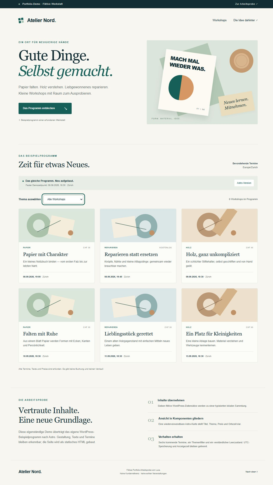

# Atelier Nord — WordPress content rebuilt with Astro

A small, independent migration exercise: the same seven fictional workshop records and the design from our [WordPress shortcode demonstration](https://github.com/luca-builds-ch/wordpress-shortcode-demo) are rebuilt as a static Astro page with a client-side topic filter.

**This is an intentional portfolio demonstration. Atelier Nord, the events and prices are fictional. It is not a client project or a paid customer reference. There is no booking, payment flow, external API or live CMS connection.**

## What was transferred

Content was manually ported from the WordPress demo's `demo/seed.php`; this repository is not an automated WordPress export tool. The standalone Astro page does not load PHP or connect to WordPress.

| WordPress sample | Astro implementation |
| --- | --- |
| `atelier_workshop` posts: title and excerpt | Typed `Workshop` records in `src/data/workshops.ts` |
| `atelier_topic` taxonomy | Typed topic keys, shared labels and a native select filter |
| `_atelier_start_utc` Unix seconds | Explicit UTC ISO strings ending in `Z`; compared as epoch milliseconds |
| `_atelier_fee` | `feeChf`; zero remains “Kostenlos” |
| `WP_Query` selects and orders upcoming posts | `upcomingWorkshops()` selects and orders at build time |
| Shortcode card markup | Reusable `WorkshopCard.astro` component |
| Own demo theme | Adapted local CSS; no external fonts or images |

The fixed demo instant is **8 September 2026, 18:30 in Europe/Zurich**, stored as `2026-09-08T16:30:00Z`. There are seven source records, six upcoming results and two results per populated topic. The sample intentionally stays fixed when built on a later day. It is not a production event feed or a claim of a live migration.

Dates are stored as instants and displayed explicitly in `Europe/Zurich`. No local timezone offset is added to stored timestamps. The source array is not mutated when results are sorted.

## Run locally

Prerequisites: **Node.js 24** and **pnpm 11.19.0**. Astro and the checking tools are project dependencies; no globally installed Astro is needed.

```sh
pnpm install --frozen-lockfile --ignore-scripts --store-dir .pnpm-store
pnpm test
pnpm build
pnpm preview
```

Open `http://127.0.0.1:8787/`. The preview script binds only to `127.0.0.1`. `pnpm build` runs `astro check` first and produces the static files in `dist/`.

Astro 7 starts preview as a background service. From this project directory:

```sh
pnpm run preview:status
pnpm run preview:stop
```

For development, use `pnpm dev`; stop the development process with Ctrl+C. No deployment or hosting account is configured. Building needs the normal ability to start the local esbuild subprocess.

Pinned toolchain: Astro **7.3.1**, `@astrojs/check` **0.9.10**, TypeScript **6.0.3**. TypeScript 6 is deliberate: this Astro checking tool currently requires the JavaScript compiler API that TypeScript 7 does not expose.

## Behaviour to inspect

1. Open `/#workshops`: all six upcoming cards render in chronological order.
2. Select Papier, Holz or Reparieren: two matching cards remain; the live status updates.
3. Select “Keramik · demnächst”: zero cards and a useful empty state appear. “Alle Workshops anzeigen” restores six cards and returns keyboard focus to the select.
4. Disable JavaScript and reload: all six cards remain readable, the unavailable filter stays hidden, and a short explanation is shown.
5. Use the skip link and keyboard controls; inspect narrow mobile and desktop layouts. All illustration shapes are decorative CSS and excluded from the accessibility tree.

## Validation

Executed on 8 September 2026 with Node **24.19.0** on Windows:

- `pnpm test`: **3 passing tests** against the actual data and functions used by the Astro source.
- `pnpm build`: Astro diagnostics **0 errors, 0 warnings, 0 hints**; successful static build of one page.
- Preview HTTP check: **200**, six rendered workshop cards and the visible fictional-demo notice.
- Independent rerun: all three tests passed and the complete checked build succeeded with Node 24.19.0.
- Browser review at 1280 px desktop and 375 px mobile: all six cards readable, each populated topic returns two, Keramik shows the empty state, and reset restores six and returns focus to the select. The mobile document had no horizontal overflow.



[Actual mobile rendering](astro-mobile.png)

The tests cover chronological selection and the inclusive cutoff, each topic and the empty result, UTC input validation, and the repeated local minute at Zurich's autumn clock change. They are Node regression tests, not a simulated claim of browser testing. Browser interaction and visual review are separate from these checks.

The single-file Node test suite uses `--test-isolation=none` to avoid unnecessary worker processes in restricted local environments. It changes no source records and uses no network or private data.

## Publish manifest

Publish only these **14 files**: eight source/configuration files, `.gitignore`, the lockfile, this README, LICENSE and two actual browser screenshots.

```text
.gitignore
astro.config.mjs
package.json
pnpm-lock.yaml
tsconfig.json
README.md
LICENSE
astro-desktop.png
astro-mobile.png
src/components/WorkshopCard.astro
src/data/workshops.ts
src/pages/index.astro
src/styles/global.css
tests/workshops.test.mjs
```

Do not include `node_modules/`, `.pnpm-store/`, `.astro/`, `dist/`, preview state or local logs. The runtime downloads and generated files are not part of the source sample. No credentials or database are needed.

## Technical references

- [Astro installation](https://docs.astro.build/en/install-and-setup/): local installation and project structure.
- [Astro scripts and event handling](https://docs.astro.build/en/guides/client-side-scripts/): the page's processed TypeScript script enhances existing HTML controls.
- [Astro TypeScript](https://docs.astro.build/en/guides/typescript/): `astro check` validates `.astro` files; the build alone is not a type check.

GPL-2.0-or-later, consistent with the original demo's own code and theme. See [LICENSE](LICENSE). Third-party dependencies retain their respective licenses.
